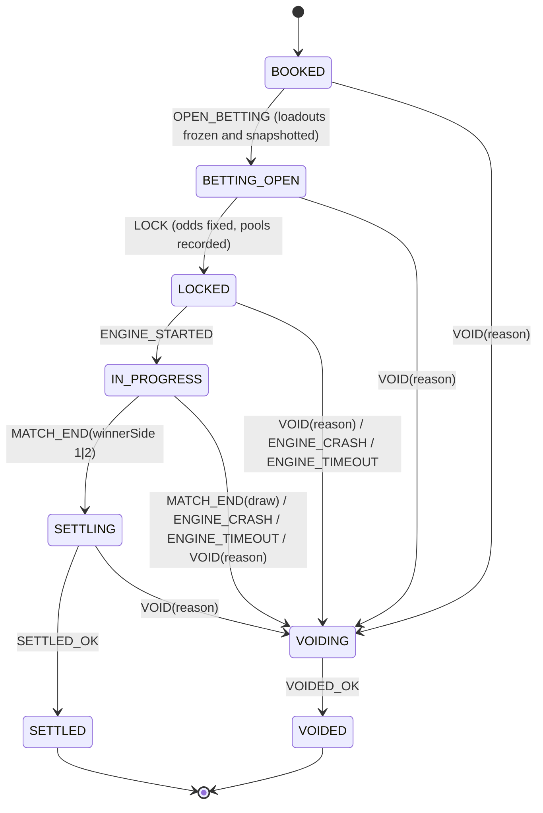

# Architecture

Phase 1 (Stream MVP) scope: house characters, match cycle, Salt ledger, betting, fixed model odds, Glicko-2 ratings and tiers, fight stats, read API with live updates. Phase 2 (§8-12) adds ownership, and phase 3 (§13 on) the community roster. Design source of truth: `docs/DESIGN.md`. Engine facts: `docs/ikemen-notes.md`.

## 1. Components

```
                         ┌───────────────────────────── orchestrator process (exactly one; pg advisory lock) ─────────────────────────────┐
                         │                                                                                                               │
  apps/web  ──HTTP/SSE──▶│  API (Fastify)  ──▶  Betting service ──┐                                                                      │
  (dev page)             │       ▲                               │                                                                      │
                         │       │ SSE bus                       ▼                                                                      │
                         │  Match cycle scheduler ──▶ Fight state machine: transition(state, event) ──▶ Settlement / Void ──▶ Ratings │
                         │       │  (matchmaking | tournaments  | exhibitions)               │                                          │
                         │       ▼                                                            │ one DB txn per transition                │
                         │  Engine runner  ──spawn(argv)──▶ IKEMEN GO ──▶ runs/<fightId>/{events.ndjson, stdout, stderr, match.log}  │
                         │   (event source: live | sim | fake)                                                                           │
                         └───────────────────────────────────────────────────────────────┬───────────────────────────────────────────────┘
                                                                                         ▼
                                                                                   Postgres (Prisma)
```

| Package | Responsibility |
|---|---|
| `packages/shared` | Types, zod event schemas (engine NDJSON, SSE, API), odds math, Glicko-2, tier bands, config schema with defaults. Pure, no I/O. |
| `packages/db` | Prisma schema and migrations, ledger (`postTransaction`, balances, audit), repositories. |
| `packages/engine` | Roster (`roster.json`, scan, smoke), `EventSource` interface with `fake` / `sim` / `live`, runner (spawn, tail, watchdog, artifacts), Lua mod installer, per-run config generation. |
| `packages/orchestrator` | Pure `transition()`, cycle scheduler, matchmaking, betting, settlement/void, startup reconciliation, Fastify API and SSE. |
| `apps/web` | One plain HTML page: stream placeholder, fighter cards, bet panel, balance. |
| `ikemen/mods/salty_events.lua` | Emits NDJSON match events when `-salty.events <path>` is passed. |

Config: one typed config object (`packages/shared/config`) loaded from env and defaults. Open questions from DESIGN §15 become config values with defaults, flagged in the commit message.

## 2. Fight state machine



- `transition(state, event) → { state, effects[] } | IllegalTransition` is pure. Effects are data (`FreezeLoadouts`, `LockOdds`, `StartEngine`, `Settle`, `RefundAll`, …) run by the orchestrator.
- Each transition is one DB transaction: update `fight` with `WHERE id = ? AND version = ?` (optimistic concurrency, `version += 1`), insert a `fight_transition` audit row (from, to, event, payload, at), and apply the ledger effects in the same transaction. SSE is published after commit.
- Void reasons: `DRAW`, `ENGINE_CRASH`, `ENGINE_TIMEOUT`, `RECONCILE_ORPHANED`, `ADMIN` (also used when the orchestrator is stopped mid-fight or hits an unexpected error: the fight is voided so no stake is stuck).
- Lock order, everywhere: per-fight ledger advisory lock → rows. Transitions take the advisory lock exclusively, then the fight row `FOR UPDATE`; bets take it shared, then the user's account row, then the fight row `FOR SHARE` (inside `placeFightBet`'s guard). So a bet and a transition on the same fight simply queue, never deadlock.
- Engine modes: `live` settles real fights; `fake` also settles (tests and `pnpm demo` need a full cycle without IKEMEN); `sim` is refused by the orchestrator and only used by `roster:smoke`. `fight.engine_mode` records which one ran each fight.
- A test table covers every (state, event) pair: legal pairs produce the expected state, and everything else is rejected.

## 3. One fight end to end

1. **Book.** Scheduler asks the current mode (matchmaking) for a pairing: two enabled characters in the same tier, not a mirror match (same fighter design), not a rematch within the last `rematchCooldown` fights (default 3), model chance in 40–60% (or a deliberate upset, the most lopsided same-tier pair, at the configured rate, default 10%). If no tier has a valid pair (a small roster spread across tiers), the closest-rated cross-tier pair is used (`crossTierFallback`, default on) rather than stalling the stream. Corners are randomized. Stage from `crypto.randomInt`. The fight records its cycle position (`cycle`, `segment`, `segment_index`) and `pair_kind`. Insert `fight` in `BOOKED`. In the exhibition segment the oldest accepted challenge is booked instead (`CHALLENGE`), else a house showcase (`SHOWCASE`), see §10. In the tournament segment the bracket's next match is booked (`TOURNAMENT`), see §11.
2. **Open betting.** `OPEN_BETTING`: snapshot both loadouts (stats, rating, RD, volatility, tier) into `fight_loadout`. These are immutable from here. Betting window starts (default 60 s). SSE `state` and live estimated odds.
3. **Bets.** `POST /fights/:id/bet {side, amount, idempotencyKey}`. In one transaction: take the per-fight ledger lock (shared) and `SELECT … FOR SHARE` the fight row and require `BETTING_OPEN` (the `LOCK` transition takes `FOR UPDATE` on the same row, so no bet can commit after pools are snapshotted), `SELECT … FOR UPDATE` the user's available account, reverse their previous bet on this fight (escrow → user) if any, check funds, post the new stake (user → escrow[side]), and upsert `bet` (latest counts). Enforce the owner cap (0 owners now), min bet 1 and max stake. SSE odds update (model odds only; crowd split hidden).
4. **Lock.** `LOCK`: compute the model chance from Glicko-2 expected score (both deviations), round it to basis points, clamp to [5%, 95%] (side 2 = 100% − side 1), then per side `multiplierBp = ⌊10000 × (10000 − marginBp) / chanceBp⌋`, floored at `minMultiplierBp` (1.00×). This is exactly `(1/p)(1 − margin)` in integers, e.g. 50% → 19000 (1.90×). From here on, money math is bigint only. The crowd blend (`w = maxWeight × pool/(pool + K)` over per-account-capped stakes) is computed and recorded, but `crowdMaxWeightBp = 0`, so locked odds equal model odds. Live odds shown during betting are model-only. Record `model_chance`, `crowd_chance` (per-account capped share), pools per side, and locked multipliers. Blend weight `w = pool/(pool+K)` is computed and stored but **config weight 0**, so locked = model.
5. **Fight.** Runner builds argv from the loadouts and stage and spawns the engine. `ENGINE_STARTED` → `IN_PROGRESS`. Events are tailed from `runs/<fightId>/events.ndjson` and broadcast as SSE. The watchdog kills at `engine_timeout` → `ENGINE_TIMEOUT` → void. Exit without `match_end` → `ENGINE_CRASH` → void.
6. **Result.** `match_end {winnerSide: 1|2}` → `SETTLING`. `winnerSide: 0` (draw) → `VOIDING`. Winner is a **side**, mapped to the character id the runner launched on that side.
7. **Settle (one transaction).** Pay winners, sweep losers to house (§4), pay the winner's owner (§10), update both characters' records, run a Glicko-2 update (one-game rating period per fight, each side rated against the other's pre-fight rating), re-evaluate tiers (promotion at the band threshold; demotion only below threshold − hysteresis, default 25; append `tier_history` on change; X is manual only), award titles (§9), write `fight_result`, → `SETTLED`.
8. **Void (one transaction).** Refund every bet in full (escrow → user, no margin), no rating change, → `VOIDED`.
9. Scheduler books the next fight only after the current one is terminal (`SETTLED` or `VOIDED`), so matchmaking and loadout snapshots always use settled ratings. As on Salty Bet, the betting window is the gap between fights.

**Startup reconciliation:** acquire the advisory lock, then for each non-terminal fight: `BOOKED` or `BETTING_OPEN` → void (`reconcile_orphaned`), since the betting window was lost; `LOCKED` / `IN_PROGRESS` with no live process → void; `SETTLING` → retry settlement (idempotent keys); `VOIDING` → retry void.

## 4. Ledger (fixed odds)

Double-entry, integer Salt (`numeric(20,0)` ⇄ `bigint`). Every `ledger_txn` has entries summing to zero per asset, a unique `idempotency_key`, a `kind`, and references (fight, bet, user).

**Accounts** (`account(id, kind, owner_ref, asset='SALT', balance_cached, version)`):

| Account | Kind | May go negative? |
|---|---|---|
| `user:<userId>` | user available | **No** (checked under row lock) |
| `escrow:<fightId>:1`, `escrow:<fightId>:2` | fight escrow per side | No; ends at 0 when the fight is terminal |
| `house` | backs payouts; collects losing stakes and margin | Yes (P&L account) |
| `issuance` | source of grants and bailouts | Yes (goes negative by total Salt issued) |
| `sink` | Salt spent in the shop and on upgrades: out of circulation | No (only grows) |

**Postings** (debit = −, credit = +; each row sums to 0):

| Event | Entries |
|---|---|
| Starting balance / daily grant / bailout | `issuance −a`, `user +a` |
| Place bet `s` on side k | `user −s`, `escrow:k +s` |
| Change bet | reverse the old stake (`escrow:k −s₀`, `user +s₀`), then place the new one; one txn |
| Settle, side k wins, bet `s` at locked `multiplierBp_k` | payout `P = min(s × multiplierBp_k / 10000, maxPayout)` in bigint (integer division rounds down); `escrow:k −s`, `house −(P − s)`, `user +P` |
| Settle, losing side j | `escrow:j −Σs_j`, `house +Σs_j` |
| Void | per bet: `escrow:k −s`, `user +s` |
| Shop purchase (and later upgrades) | `user −price`, `sink +price` |

- Payouts round **down**, and the remainder stays with the house automatically (the house pays `P − s`).
- **Minimum multiplier 1.00× (`minMultiplierBp = 10000`, config).** At the 95% clamp with 5% margin the formula gives exactly 1.0 on paper, but float error can give 0.9999…, and any margin above 5% gives less than 1.0. Without a floor, a *winning* bet would lose Salt. Flagged for review.
- To keep `P ≥ s` under the payout cap, bets with `s > maxPayout` are rejected at placement.
- **Idempotency keys** (unique on `ledger_txn`, stored with a hash of the request so a reused key with a different body is rejected): bets use the client's key scoped to the user (`bet:<userId>:<clientKey>`); system writes use deterministic keys: `grant:start:<userId>`, `grant:daily:<userId>:<UTC date>`, `bailout:<userId>:<n>`, `settle:<fightId>`, `void:<fightId>`. Settlement and void are each one ledger txn for the whole fight, so retrying after a crash is a no-op, and a fight can't be both settled and voided.
- **Locks:** each operation takes its locks *before* checking its idempotency key, so concurrent duplicates queue and then replay. Bets take a per-fight advisory lock in shared mode plus the user's account row (`FOR UPDATE`); settle/void take the per-fight lock exclusively. No bet can commit during or after a fight's settlement.
- **Database guards** (migration `ledger_guards`): balances are maintained by a trigger on `ledger_entry` and can't be edited directly; a `CHECK` rejects any negative user or escrow balance; a deferred constraint trigger rejects any txn that doesn't sum to zero at commit; `ledger_txn` and `ledger_entry` are append-only.
- `ledger:audit`: every txn sums to zero; each `balance_cached` equals Σ entries; no user or escrow account is negative; escrow for terminal fights is 0; Σ all balances per asset is 0.
- The `asset` column exists everywhere with only `SALT` allowed, so a second asset later is data, not a migration.
- Tournament balances (phase 2) are a second currency, `TSALT`, on the same ledger, in one closed **book** per tournament: that tournament's own issuance, house, player and escrow accounts (`user:<id>:TSALT:<tournamentId>`, ...). Plans stay book-agnostic; the db layer maps them to the fight's book. A deferred trigger rejects any transaction that touches two books, so T-Salt can never become Salt (§11).

## 5. Engine event sources

```ts
interface EventSource {
  run(spec: FightSpec, signal: AbortSignal): AsyncIterable<EngineEvent>; // ends with match_end | engine_crash | engine_timeout
}
```

- `fake`: scripted, no engine. Deterministic from a seed; can script draws, crashes and hangs. Used by tests and `pnpm demo`.
- `sim`: real engine with `-speedtest`, `-nosound`; smoke tests only, **never settles bets** (enforced in the orchestrator).
- `live`: real time, rendered; the only mode that settles.

Engine events (NDJSON, zod-validated): `match_start`, `round_start {round}`, `round_end {round, winnerSide|0, reason: ko|time}`, `match_end {winnerSide|0}`. Parsing `-log` after exit is the fallback if the Lua path fails (see ikemen-notes §2).

## 6. API and live updates

Fastify, same process as the orchestrator (they share the event bus). `GET /api/me` includes the player's staff `role` and `permissions`; staff routes answer 403 to everyone else. Salt amounts are integer strings in and out; a JSON number is accepted for a stake only if it's a safe integer. Auth: a session token in `Authorization: Bearer`, from `POST /api/session` (anonymous player with the starting balance) or an emailed one-time sign-in link. Sessions live in their own table (several devices, 30-day expiry, sign-out); tokens and links are stored only as SHA-256 hashes. A sign-in link requested by an anonymous player attaches the email to that player, keeping their Salt and bets; if the email already has an account, the link signs in to it instead. Links expire after 15 minutes, work once, and are limited to 5 per email per hour. Mail goes through SMTP when `GI_SMTP_URL` is set, otherwise it's printed to the server console.

| Route | Purpose |
|---|---|
| `POST /api/session` | New anonymous player + token |
| `POST /api/auth/email`, `POST /api/auth/verify`, `POST /api/auth/logout` | Send a sign-in link (`{email}`), redeem it (`{token}` → session token), sign out this device |
| `GET /api/me`, `GET /api/me/bets` | Balance, open stakes, grant/bailout availability; bet history |
| `POST /api/me/daily-grant`, `POST /api/me/bailout` | Faucets |
| `GET /api/fights/current`, `GET /api/fights/:id` | Fighters (frozen loadout once betting opens), tier, rating, record, win rate, last-10 form, head-to-head, odds (live model estimate before lock; locked odds, pools and crowd chance after), rounds, result, the viewer's bet |
| `POST /api/fights/:id/bets` | `{side, stake, idempotencyKey}`; latest bet counts until lock |
| `POST /api/characters/:id/upgrade`, `POST /api/characters/:id/sidegrade` | Owner only: `{stat, idempotencyKey}` raises one level; `{sidegrade or null, idempotencyKey}` picks, switches or removes a sidegrade |
| `GET /api/cosmetics`, `PUT /api/characters/:id/cosmetics` | Catalogue of titles, name plates and badges (labels, colours); owner only: `{title?, nameplate?, badges?}` picks what the overlay shows (a missing field = automatic, free) |
| `GET /api/shop`, `POST /api/shop/buy`, `GET /api/me/characters` | Current rotation (price, rarity, First Editions left, when it changes), buy `{fighterId, idempotencyKey}`, your characters |
| `GET /api/challenges/options`, `GET /api/me/challenges`, `POST /api/challenges` | Your characters and other players' you can challenge; your incoming and outgoing challenges (queue position, fight once booked); send `{challengerCharacterId, challengedCharacterId}` (sending an open one again returns it) |
| `POST /api/challenges/:id/accept`, `/decline`, `/cancel` | The challenged owner accepts or declines; the challenger cancels until it's booked |
| `GET /api/tournaments`, `/api/tournaments/current`, `/api/tournaments/:id` | Recent tournaments; the bracket by round (seeds, winners, walkovers, fight numbers), T-Salt standings, podium and the viewer's T-Salt |
| `GET /api/results`, `/api/leaderboard`, `/api/characters`, `/api/characters/:id` | Recent results, players by Salt won in the running season (§14), character ranking (with owner), character profile (titles with provenance, tier history, upgrades, recent fights, former names, license) |
| `POST /api/characters/:id/name`, `POST /api/reviews/:id/withdraw` | Owner only: ask for a custom name `{name}` (waits for staff review; asking again while it waits returns it); take a waiting request back |
| `GET /api/staff/queue`, `POST /api/staff/reviews/:id/approve`, `/reject`, `/request-changes` | Staff: waiting requests (names and fighter submissions) oldest first and recent decisions; decide with `{note?}` (a note is required to reject or ask for changes; asking for changes is for submissions only) |
| `GET /api/submissions/rules`, `GET /api/me/submissions`, `POST /api/submissions`, `PATCH`/`GET /api/submissions/:id` | Fighter submissions (§15): what the form needs (open or not, limits, archetypes, image kinds, rights options); yours; start a draft or edit it with `{community, fighterName, archetype, description, rightsBasis, rightsDetails, rightsLink}`; one submission for its submitter or staff |
| `PUT /api/submissions/:id/files?role=&label=`, `DELETE`/`GET /api/submissions/:id/files/:fileId`, `POST /api/submissions/:id/submit`, `/withdraw` | Add an image (the raw PNG as the body), remove one, fetch one (submitter and staff only, served as `image/png` with `nosniff`); send for review with `{confirmRights: true}`; withdraw |
| `GET /api/staff/search?q=`, `POST /api/staff/players/:id/reset-name`, `POST /api/staff/characters/:id/reset-name` | Staff: find players (display name, exact email or id) and characters; reset a display name or a custom character name with `{note}` (the reason) |
| `GET /api/staff/log`, `GET /api/staff/members`, `PUT /api/staff/members` | Staff: the staff log and staff list (emails for admins only); admin only: `{email, role: MODERATOR or PLAYER, note?}` appoints or removes a moderator |
| `GET /api/stream` | SSE: `fight_state`, `odds_live`, `odds_locked`, `engine_event`, `fight_result`, `title_earned`, `tournament` (started, cancelled, finished with champion and podium), `season` (started; ended with champion and top bettor), `ballot` (opened with its fighters; closed with counts and who was elected), `release` (community fighters joining the roster), keep-alive comments |
| `GET /api/me/wallets`, `POST /api/me/wallets/challenge`, `POST /api/me/wallets/verify`, `DELETE /api/me/wallets/:id` | Link a Solana wallet (§17): ask for a one-time message `{address}`, send the wallet's signature `{nonce, signature (base64)}`; list or unlink wallets |
| `GET /api/me/nfts`, `GET /api/nft/collections`, `POST /api/submissions/from-nft` | NFTs in your linked wallets from approved collections (and whether NFT lookups are set up); the approved collections; start a submission from an NFT `{assetId, archetype?}` |
| `POST`/`DELETE /api/characters/:id/look`, `GET /api/looks/:id/image` | Owner only: wear an NFT look `{assetId}` on your copy of its community's fighter, or take it off; a look's image (public) |
| `GET`/`PUT /api/staff/collections` | Staff see the collections; admins add or change one `{address, name, licenceUrl, licenceNote, submissionsAllowed, looksAllowed, fighterId, enabled}` |
| `GET /api/ballot/current`, `/api/ballots/:season`, `POST /api/ballot/votes`, `DELETE /api/ballot/votes/:submissionId` | The season ballot (§16): fighters, the viewer's eligibility, votes left and votes cast while open, published counts and who was elected once closed; vote `{submissionId}` (again returns the same vote); take a vote back |
| `GET /api/seasons`, `/api/seasons/current`, `/api/seasons/:number` | Recent seasons (dates, champion, top bettor); one season: the running one with live standings, who'd win if it ended now, and the viewer's rank, or an ended one's final standings |

`apps/web` holds plain pages (no build step). The player site shares `site.css` and `site.js` (session, API calls, the header with navigation and wallet, toasts, one SSE connection per page, sign-in links on any page; when the stream opens but stays silent for 6 s, as behind a proxy that holds SSE back, it polls `GET /api/fights/current` every 3 s and hands the pages the same `fight_state`, `odds_live` and `fight_result` events until the stream's `hello` arrives): home `/` is watch and bet (video, betting, matchup and chat; `GET /api/site` says which Twitch channel to embed, `GI_TWITCH_CHANNEL`), then shop, my fighters, fighter profiles, rankings, the vote, account, how to play, terms and privacy. Fighter pictures come from `GET /api/fighters/:id/image` (the `card.png` that `templates:build` writes next to a character). The plain dev page is at `/dev.html`, and the stream overlay at `/overlay.html` (§12) uses only public routes and the SSE stream.

## 7. Data model sketch (Prisma)

- `User` (id, kind `anonymous|email`, email?, `walletAddress?` reserved, createdAt, lastDailyGrantAt)
- `Fighter` (id, archetype, defPath, displayName, licenseNote, enabled)
- `Character` (id, fighterId, `ownerKind='house'`, ownerUserId?, stats JSON with defaults, wins, losses, voids, rating, rd, volatility, tier, tierLocked (X))
- `TierHistory`, `Stage` (id, defPath, licenseNote, enabled)
- `Fight` (id, state, version, mode, stageId, bookedAt, windows, voidReason?, winnerSide?, winnerCharacterId?)
- `FightLoadout` (fightId, side, characterId, stats, rating, rd, volatility, tier), immutable
- `FightOdds` (fightId, modelChance[2], crowdChance[2], pool[2], blendWeight, lockedMultiplierBp[2] as integers; chances as floats for analysis only)
- `FightTransition` (audit), `Bet` (fightId, userId, side, stake, status, payout?), `Account`, `LedgerTxn`, `LedgerEntry`, `IdempotencyKey`
- Phase 2: `Session`, `LoginToken` (sign-in links), `Character` ownership (serial, First Edition, purchase txn), upgrade levels, sidegrade and `cosmetics` (the owner's pick), `CharacterChange` (upgrade history), `CharacterTitle` (earned titles with the fight and the owner at the time, append-only), `FightLoadout.cosmetics` (frozen with the loadout), `Challenge` (exhibition challenges; status only moves forward), `OWNER_REWARD` ledger transactions, `Tournament`, `TournamentEntry` (seeds), `TournamentMatch` (bracket; `Fight.tournamentMatchId` links its fights), `PlayerTitle` (T-Salt podium), `TSALT` accounts with `tournamentId`. The schema in `packages/db/prisma/schema.prisma` is the source of truth.

## 8. How stat upgrades reach the engine

```
upgrade/sidegrade → Character levels + effective stats ──(frozen at OPEN_BETTING)──▶ FightLoadout.stats ──▶ runner ──▶ argv / per-fight character copy
```

- Owners raise four stats (life, attack, defense, starting power) over five levels with shrinking gains, or pick one sidegrade; Salt goes to the sink; each change widens the rating deviation by 30 (max 350) and is kept in `character_change` (it travels with the character). Rules and costs: `packages/shared/src/upgrades.ts`, defaults in docs/PHASE2.md.
- Changes apply from the next fight whose betting opens; a loadout already frozen is untouched.
- The runner passes life and starting power as `-p<n>.lifeMax/.life/.power` flags. For attack/defense it launches a copy of the character (`chars/gi-loadout-<hash>/`) whose own `[Data] attack/defence` are scaled, reused while unchanged, newest 64 kept. `argv.json` records which copy each side used.

## 9. Titles and overlay cosmetics

```
SETTLE ──▶ applyFightRating ──▶ awardFightTitles ──▶ character_title (+ SSE title_earned after commit)
titles + First Edition ──▶ unlocked cosmetics ──(owner's pick or automatic)──▶ frozen at OPEN_BETTING ──▶ FightLoadout.cosmetics ──▶ overlay
```

- Titles are awarded in the settlement transaction from the frozen loadout tiers and the rating update: First Blood, 10 Wins, 100 Wins, Giant Slayer (beat a character 3+ tiers higher, P < B < A < S < X), and tier firsts for each band reached for the first time on a promotion (not the starting tier, not a climb back). Tournament Champion (§11) and Season Champion (§14) are awarded outside fights and can be earned again. Rules: `packages/shared/src/titles.ts`.
- `character_title` is append-only; each row keeps the fight and the owner at the time, and one-time titles are unique per character. `pnpm titles:backfill` replays settled fights' loadouts to award titles for fights from before titles existed (same rules; a test checks it matches live awarding).
- Each title unlocks a badge, and some a name plate; First Edition copies also get a badge. The owner can pick one title, one name plate and up to 3 badges; anything not picked is automatic (best unlocked). Cosmetics never change stats. Like upgrades, a pick applies from the next fight whose betting opens.
- The catalogue (labels, ranks, colours) is data in code, served by `GET /api/cosmetics` for the future overlay; fight views return each side's frozen cosmetics with labels and colours.

## 10. Exhibitions and owner rewards

```
send (challenger) ──▶ PENDING ──accept──▶ ACCEPTED ──(exhibition segment, oldest accepted first)──▶ BOOKED ──▶ fight
                        │ decline / cancel / expire (24 h)        │ cancel
                        ▼                                         ▼
               DECLINED | CANCELLED | EXPIRED                 CANCELLED
```

- **Challenges** are owner vs owner: your character against another player's (never a house character, never your own, never two copies of the same fighter). One open challenge per pair of characters, at most 5 open per player. Free: no Salt changes hands, and everyone bets as usual (owners of either side are capped as in any fight). Rules: `packages/shared/src/exhibitions.ts`; the `challenge_guard` trigger keeps rows and only lets status move forward.
- **Booking.** Each exhibition slot takes the oldest accepted challenge whose characters are both active (it stays queued otherwise), booked with random corners and `pair_kind = CHALLENGE`. With no challenge waiting, a **house showcase** pairs two of the strongest house characters (X tier first, then rating; pool of 6) across tiers, with the usual no-mirror and no-immediate-rematch rules. If a challenge's fight is voided, the challenge is used up; the owners can send a new one.
- **Owner rewards.** When a player's character wins on stream, settlement pays its owner 25 Salt from issuance (`OWNER_REWARD`, key `owner-reward:<fightId>`), in the same transaction and before the rating update (user accounts are locked before character rows, as upgrades do). Tournament-segment fights don't pay it. The ledger audit checks each reward belongs to a settled, non-tournament fight and went to the winner's owner. Fight views show the reward; "My characters" shows each character's total.

## 11. Tournaments

```
cycle position -> TOURNAMENT segment -> ensureTournament(cycle): tier S/A/B/P by cycle, seats, seeds, all bracket matches
             -> nextTournamentMatch: earliest undecided match with both sides (walkovers for disabled characters) -> fight (TOURNAMENT)
SETTLE -> decideMatch: winner moves to (round + 1, slot / 2) -> after the final: champion title, T-Salt podium titles, FINISHED
VOID   -> the match stays open and is booked again
```

- **When.** The tournament segment of a cycle lasts until its bracket is decided (`nextPosition` takes a "tournament done" check), so voided fights are simply replayed. A tournament that can't seat 2 characters is recorded as CANCELLED and the cycle moves on. Bracket size is `GI_CYCLE_TOURNAMENT_SIZE` (16); below 2 turns tournaments off.
- **Seats.** Tier rotates S, A, B, P by cycle. Players' characters in the tier first, then its house characters, then house characters from other tiers closest to the band; never X. The bracket is the largest power of two that fills (up to 16), seeded by rating in standard order (1 v 16, 8 v 9, ...). Rules: `packages/shared/src/tournaments.ts`; bracket code: `packages/orchestrator/src/tournaments.ts`.
- **Fights** rate characters and award fight titles as usual, but pay no owner reward. A disabled character forfeits (walkover). The `tournament_match_guard` trigger keeps decided results and filled sides fixed.
- **T-Salt.** A player's first bet in a tournament grants them 1,000 T-Salt from that tournament's issuance (`TOURNAMENT_GRANT`, key `tgrant:<tournamentId>:<userId>`). Bets, payouts and refunds on tournament fights run in that book. Main-Salt views (open stakes, bailout, leaderboard) ignore T-Salt. The audit checks each book sums to zero and no transaction crosses books, and reports T-Salt totals separately.
- **End.** The champion character earns Tournament Champion (with the tournament and final fight). The top 3 T-Salt balances above the starting 1,000 earn player titles (Top, Runner-up, Third-place Bettor), earlier joiner first on a tie.

## 12. Stream overlay and OBS

```
fight_state (bus) ──▶ ObsSceneSwitcher ──obs-websocket 5──▶ OBS: "Fight" while IN_PROGRESS, "Betting" on BETTING_OPEN / SETTLED / VOIDED
/api/stream (SSE) ──▶ overlay.html ──▶ betting screen or fight bar (auto: by fight state)
```

- **Overlay** (`apps/web/overlay.html`, `.css`, `.js`): laid out on a 1920x1080 grid in CSS units derived from the width, so it scales to any 16:9 browser source. It refetches `/api/fights/current` on state, odds and round events, shows each side's frozen cosmetics (name plate colours, title, badges from §9), odds, win chance, the countdown, pools after lock, round markers (`roundsToWin`), a result banner (winner, rating change, tier change, owner reward, or "no contest"), toasts for titles and tournaments, and a footer with recent results or who's still in the tournament. T-Salt fights are labelled.
- **Setup** (`pnpm obs:setup`, `packages/orchestrator/src/obs-setup.ts`): creates the Fight and Betting scenes with a screen capture and the two overlay views through the same WebSocket, adds only what's missing, and reloads the overlay sources.
- **Scene switching** (`packages/orchestrator/src/obs.ts`): optional (`GI_OBS_URL`). Uses Node's built-in WebSocket client, identifies with `eventSubscriptions: 0`, answers the password challenge, and sends `SetCurrentProgramScene` only when the wanted scene changes. It reconnects every 5 s, reports each kind of problem once, and never stops the stream. Protocol facts and what's still unverified: docs/obs-notes.md.

## 13. Staff and the review queue (phase 3)

```
owner: POST /api/characters/:id/name -> review_item PENDING -> staff.html queue -> approve: character renamed, previous name kept
                                                                             -> reject (with a note the owner sees)
                                    <- owner withdraws while it waits
every staff action -> staff_action (append-only log: who, their role then, what, why)
```

- **Roles** (`user.role`: PLAYER, MODERATOR, ADMIN). Rules in `packages/shared/src/staff.ts`. Moderators review, reset names and read the log; admins also appoint and remove moderators on the staff page. Admins are set only from the server's command line (`pnpm staff:role <email> admin`), which is logged with no actor. Staff need a verified email (`user_staff_verified` check). Every staff request reads the role from the database, so removing a moderator takes effect at once.
- **Review queue** (`review_item`, kind `CHARACTER_NAME` for now; fighter submissions come later). One waiting name per character (partial unique index). A decision is final and what was asked can't change (`review_item_guard`). Nobody decides their own request, except an admin (logged like anything else).
- **Names** (`packages/orchestrator/src/staff.ts`): 3-20 characters, ASCII letters, digits, spaces and `' - . &` (no `#`, so a custom name can't look like an automatic "Grey Monk #1", and no lookalike letters from other alphabets). Unique ignoring case against every character, every fighter's name and other waiting requests; requests and approvals of the same name take turns on an advisory lock (7105). Approval checks the owner and the name again. A fight's loadout keeps the name it was booked with; the new name shows from the next fight. After an approved name, the next request can come `GI_RENAME_COOLDOWN_DAYS` (7) later.
- **Resets.** Staff can clear a player's display name (they show as "Anon-…") or put a custom character name back to the automatic one; both need a reason, kept in the log.
- **Staff page** (`apps/web/staff.html`): the queue, search and resets, the staff list (admins: appoint or remove by email), and the log. It uses the main page's session.

## 14. Seasons (phase 3)

```
bookFight ──▶ advanceSeason: no season yet -> Season 1 starts now
                            running season past ends_at -> final standings, Season Champion, Season Top Bettor, ENDED
                                                        -> next season starts at the old ends_at (or now, after a break longer than a season)
```

- **Clock.** Checked at the start of every booking, in the same transaction (advisory lock 7106); it also opens and closes the season's ballot (§16); bus `season` events go out after commit. A season is a date window: a fight belongs to the season its result came in (`fight.closed_at`), so a fight that straddles the end counts in the next one. Length `GI_SEASON_WEEKS` (8).
- **Standings.** Players: Salt won (winnings minus stakes) on settled Salt bets; T-Salt bets never count. Characters: rating now (at the end: the final rating) and the season's record, active characters only. Rules: `packages/shared/src/seasons.ts`; queries and the end of a season: `packages/orchestrator/src/seasons.ts`.
- **Titles.** Season Champion (character, like Tournament Champion: once per season, repeatable, with its owner at the time; unlocks the Legend name plate and SC badge) goes to the best-rated character with at least `GI_SEASON_MIN_FIGHTS` (10) fights that season. Season Top Bettor (player) goes to the player with the most Salt won who came out ahead with at least `GI_SEASON_MIN_BETS` (10) bets. Either can go unawarded.
- **What resets.** The player leaderboard (`/api/leaderboard`) is Salt won in the running season, so it starts over each season: there's no all-time balance ranking (DESIGN §9: reset leaderboards, not balances). Balances, characters, ratings, records and titles never reset; nothing here touches the ledger.
- **Kept.** The top 20 players and characters of each ended season (`season_standing`, append-only). `season_guard` keeps seasons in order without overlaps, one running at a time, dates fixed and ended seasons unchanged.

## 15. Fighter submissions (phase 3)

```
submit.html: draft (details + PNG images) --send, confirming rights--> SUBMITTED --staff.html--> APPROVED (goes to the ballot, step 5)
                  ^                                                              |-> CHANGES_REQUESTED (note) --fix, send again--^
                  withdraw any time before a decision                            |-> REJECTED (note; final)
```

- **Who.** Staff only until `GI_SUBMISSIONS_OPEN=true` (off by default: opening to the public waits for the terms for submitted art). A verified email is always required. One open submission per account and per community (`submission_one_open_per_community`); communities compare ignoring case.
- **What.** Community, fighter name (same rules as custom character names, and unique against characters, fighters, other open or approved submissions and waiting name requests), archetype, optional description, and a rights statement: where the rights come from (made it ourselves, licensed, NFT collection's holder licence), an explanation, and a link to the licence (needed unless it's original). Images by kind: sprite sheets (1-16), a portrait (1), intro (1-2), win pose (1-2), alternate colours (0-6); 24 in all. Rules: `packages/shared/src/submissions.ts`.
- **Images.** PNG only, checked by reading the file's signature and header (not the name or content type the browser sends): at most 8 MB (`GI_SUBMISSION_MAX_FILE_MB`) and 4096 px a side. Uploaded as the raw request body. Stored outside git in `GI_SUBMISSIONS_DIR` (default `submissions/`, gitignored) as `<submission id>/<sha256>.png`, written to a temporary name first; paths never use anything the submitter typed. Only the submitter and staff can fetch them, until the fighter is on a ballot (then anyone can). Files stay on disk after removal or a decision, as a record of what was reviewed.
- **Review.** Sending creates a `review_item` of kind `FIGHTER_SUBMISSION`; each send is a new request, so the history of decisions and notes is kept. Staff approve, ask for changes, or reject (a note is required for the last two and the submitter sees it); the same staff rules and staff log as §13 apply. Approving checks the fighter name is still free.
- **Guards.** `submission_guard`: kept; details change only in draft or after changes were asked for; status moves only along the steps above; decided and withdrawn submissions never change. `submission_file_guard`: images are added or removed only while the submission can be edited, and never changed.
- **Automatic checks** (step 4; `submission-checks.ts`, `packages/engine/src/balance/check.ts`, rules in `packages/shared/src/checks.ts`). `sendForReview` queues a `submission_check` row in the same transaction (when `config.checks.enabled`); staff queue another with `POST /api/staff/submissions/:id/checks`. `createCheckRunner` (started by `pnpm dev`) claims the oldest queued row (`FOR UPDATE SKIP LOCKED`), picks the cast from the roster as it is (the fighter's stand-in from `pickStandIn`, up to 4 other templates as opponents, up to 3 of our stages), and runs `checkFighter`: a smoke fight, `templateFindings` (the fighter's `fighterNumbers` against its template's, when it has its own), and the balance simulation (`versus` plans, `runSeries`), with the reference's record kept in memory between runs. The row ends PASSED or FAILED with the `CheckResults` JSON, or ERROR with a reason when the checks couldn't run (no engine, no opponents). Staff read the latest run on `GET /api/submissions/:id` (`checks`, with a line per check from `describeChecks`) and its status in the review queue; submitters don't see it. Runs in progress when the server stops go back to the queue at the next start.
- **Check guards.** `submission_check_guard`: runs are kept; a finished one never changes; QUEUED → RUNNING → PASSED, FAILED or ERROR (RUNNING → QUEUED after a restart). `submission_check_shape`: what each status carries. `submission_check_one_open`: one waiting or running per submission.
- **Own art** (`own-art.ts`, `packages/engine/src/templates/guide.ts`). `createOwnArtBuilder` (given to the check runner by `pnpm dev`) looks for the sprite sheet the size of the archetype's guide, reads it (`artFromGuide`: RGBA to at most 239 palette colours by median cut, every box drawn and none cut off), builds it on the template (`communityFiles`: the template's code with the new art and reach, the submitter's names made engine-safe by `engineText`) into `chars/gi-sub-<number>/` (`writeCharacter`, our id only), and hands the check its numbers and the template's (`numbers.json`, written by `templates:build`). The check's `checkedAs.defPath` is what release uses. Staff see the build's `card.png` at `GET /api/staff/submissions/:id/card`.

## 16. Voting (phase 3)

```
season clock: voting window starts (last GI_VOTING_DAYS of the season) -> ballot OPEN with every APPROVED submission not on a ballot yet
players: POST /api/ballot/votes (3 each, one per fighter, can take back) ... counts hidden
season clock: season ends -> count, rank, elect the top 2 with >= 1 vote -> submissions ELECTED / NOT_ELECTED -> ballot CLOSED (counts published)
```

- **Voters.** A verified email, an account at least `GI_VOTER_MIN_AGE_DAYS` (14) old and at least `GI_VOTER_MIN_BETS` (20) bets (Salt or T-Salt). Checked on every vote; an account's votes take turns on an advisory lock (7109) so the `GI_VOTES_PER_VOTER` (3) limit holds. Rules: `packages/shared/src/voting.ts`; ballot code: `packages/orchestrator/src/voting.ts`.
- **Ballot.** One per season (`ballot.season_id` unique), created at the first booking in the voting window if anything is approved; a submission is on one ballot at most (`ballot_entry.submission_id` unique). Fighters on a ballot, and their images, are public; counts are not until it closes.
- **Result.** At the season's end, before the season's own titles: most votes first, ties to the fighter first sent for review; the top `GI_ELECTED_PER_SEASON` (2) with at least one vote are ELECTED, the rest NOT_ELECTED (their names are free again and their communities can submit again). Elected fighters join the roster at the next season (step 6, not built yet).
- **Guards.** Votes are cast or taken back only while the ballot is open and uncounted, never edited (`vote_guard`); entries are never removed and their results written once (`ballot_entry_guard`); a ballot closes only with every result counted and never changes after (`ballot_guard`); a submission becomes elected or not only by matching its ballot result (`submission_guard`).

## 17. Holders and NFTs (phase 3)

```
dev page: connect wallet -> POST challenge {address} -> wallet signs the message (free) -> POST verify {nonce, signature} -> wallet linked
GET /api/me/nfts -> DAS getAssetsByOwner for each linked wallet -> only NFTs from approved collections
"Submit as a fighter" -> getAsset again (still yours? approved?) -> draft submission (community, name, rights, portrait from the NFT image)
```

- **Read-only.** Wallets are proven by signing a message; NFTs are read from a DAS endpoint (`GI_SOLANA_RPC_URL`). Nothing signs or sends a transaction. Facts and what's still untried with real services: docs/nft-notes.md.
- **Wallets.** A one-time message (10 minutes, used once, `wallet_challenge_guard`), 10 requests per account per hour, Ed25519 verified with Node's crypto. Up to `GI_MAX_WALLETS` (3) per account; a wallet moves to whichever account last signed for it.
- **Collections.** Admins approve a collection on the staff page (new `manage_collections` permission; logged as `COLLECTION_SET`): whether its holders can submit fighters (needs a licence link), whether NFT looks are allowed, and which fighter is the community's (for looks). Only verified collections in DAS count.
- **Submitting from an NFT.** Rechecks the NFT's owner and collection at that moment, then starts a normal draft (§15): the collection as the community, a fighter name from the NFT's name (or "Fighter 1234" if it can't be used), "holder licence" as the rights basis with the collection's licence link, and the NFT's image as the portrait when it's a PNG. The submission keeps the NFT and collection it came from, fixed for good (ready for minting in phase 4).
- **NFT images** are downloaded by a guarded fetcher (`image-fetch.ts`): https on the standard port only, every resolved address must be public (checked when connecting), up to 3 redirects, a size cap and a timeout.
- **NFT looks.** An owner can dress their copy of a collection's community fighter (`nft_collection.fighter_id`) in an NFT they hold: the image is downloaded once (guarded fetcher), checked by its bytes (PNG, JPEG, GIF or WebP) and kept outside git in `GI_LOOKS_DIR` (default `looks/`) as `<sha256>.<type>`; for PNGs, name plate colours are read from the pixels (a small built-in PNG decoder; `plateColorsFromPixels` in `packages/shared/src/looks.ts`). The look joins the character's cosmetics, so fights freeze it and the overlay, watch page and dev page show its portrait and colours. It stays with the character for good, even after the NFT is sold; only the owner takes it off or replaces it. `nft_look_one_per_character` and `nft_look_one_per_nft` keep one look per character and each NFT's look on one character; `nft_look_guard` keeps rows as history. Recolouring the fighter's sprites, and trait kits, come with the archetype templates.

## 18. Seasonal release (phase 3)

```
season clock: season ends -> ballot counted (ELECTED) -> next season starts -> releaseElected: community fighter + house character + release row, submission RELEASED
next tournament: pendingDebuts seated first (debut = true) -> release.debut_tournament_id
shop: fighters released this season are always offered first (First Editions: the first 25 copies, as for any fighter)
```

- **The fighter.** Id `community-<name>` (`fighter.source = COMMUNITY`; `fighter_source_id` keeps the id prefix and the source together), the submission's name and archetype, rarity RARE. Until its archetype's template exists it plays with a **stand-in** engine character: the first enabled roster fighter of the same archetype, else Kung Fu Man (`pickStandIn` in `packages/shared/src/releases.ts`); its licence note says so, and profiles show it (`community` in the character profile). When the latest finished automatic check built it from its own art and its smoke test passed, it plays with that character instead (`chars/gi-sub-<number>/`, the check's `checkedAs.defPath`).
- **House character.** Created at the default rating, with the stand-in's palette; it fights on stream like any house character, and debuts in the next tournament (`pickSeats` takes debuting characters first, whatever their tier; that tournament is marked `debut`, shown as "Debut Tournament").
- **NFT collections.** A fighter submitted from an NFT becomes its collection's community fighter (if it has none), so holders can give their copies NFT looks (§17).
- **Roster sync** leaves community fighters and their house characters alone (they aren't in roster.json).
- **Guards.** A submission becomes RELEASED only with its release row; releases are kept and only get their debut tournament, once (`release_guard`).

## 20. Running in public (MVP)

- **Rate limits** (`api/security.ts`, on unless `GI_RATE_LIMITS=off`), per client address, in memory: 20 new anonymous players and 10 sign-in emails an hour, 60 bets and 600 API calls a minute, 10 open live-update connections. Over a limit: 429 with `Retry-After`.
- **Client addresses** come from `X-Forwarded-For` only when the request arrives through a trusted proxy (`GI_TRUST_PROXY`, default `loopback`: a tunnel or proxy on the same machine).
- **Security headers** on every response: a content policy that allows only our own scripts (no inline scripts or handlers anywhere in `apps/web`) and the Twitch player and chat in frames, `nosniff`, a referrer policy, and HSTS when the public address is https.
- **Health check**: `GET /api/health` answers 200 while the database works and fights keep moving, 503 when the database is down or nothing has happened for 20 minutes.
- **Production start-up** (`GI_ENV=production`, `production.ts`): refuses to start without an https `GI_PUBLIC_URL`, a mail server, `ENGINE_MODE=live`, `IKEMEN_DIR`, rate limits, a local-only `GI_HOST`, and a strong database password when the database is on another machine.
- **Housekeeping**: fight artifacts in `runs/` older than `GI_RUNS_KEEP_DAYS` (default 7) are pruned at start-up and hourly. The database port is open only to this machine. Losing the database connection that holds the orchestrator lock ends the process cleanly (a supervisor restarts it, and start-up reconciliation refunds the interrupted fight).

## 19. Fighter templates (phase 3)

```
art/sources/<sheet>.png (CC0, not in git; art/SOURCES.md)
  + packages/engine/src/templates/<archetype>.ts (the spec: frames, timing, attacks, numbers, AI)
  -> pnpm templates:build -> $IKEMEN_DIR/chars/gi-tpl-<archetype>/ (sff, air, cns, cmd, def; not in git)
                          -> runs/templates/<id>/preview-*.png with --preview
```

- **Spec** (`templates/spec.ts`): the art source (sheet grid, the ground point every frame shares, stray colours to clean, the character's localcoord), animations as sheet cells plus ticks, attacks (frames, active frames, damage, stun, push, knockdown, command, AI range and weight), constants in 320-wide units, AI tendencies, colour palettes and the portrait box. `checkSpec` finds problems without the sheet: every animation the engine's shared states need (`REQUIRED_ACTIONS`), hit frames inside their animation, valid colours.
- **Art** (`templates/art.ts`, `art/*.ts`): our own PNG reader/writer, SFF v2 writer (PNG8 sprites, see ikemen-notes §7) and `.air` writer. Each sheet cell used becomes one sprite, trimmed, with its axis on the shared ground point; the first animation to use a cell names its sprite (`action,frame`), which is the slot a community fighter's art later fills. Hurtboxes are the drawn pixels in three bands; hitboxes are the part of an active frame that reaches past the move's first pose (the fist or foot). Airborne frames can be re-grounded (`anchor: "feet"`), because the sheet renders jumps off the ground and the engine lifts the fighter itself. MUGEN's standard get-hit sprite numbers are added so other characters' throws can use them.
- **Code** (`templates/cns.ts`): the constants file (the one per-fight upgrades patch), the states (intro, win poses, taunt, one state per attack with its HitDefs) and the commands with the AI in `[Statedef -1]`. People get the usual inputs (`!AILevel`); the computer gets its own triggers (`AILevel`): `NoAIButtonJam`/`NoAICheat` turn off the engine's random presses, and `AssertInput` holds directions to walk in, back off and block. The AI decides once per incoming attack whether to block (its `block` chance, crouching against a crouching opponent), anti-airs jumping opponents, attacks with whatever reaches (weighted), cancels a normal that hit into a special, runs or jumps in from far away, and taunts a fallen opponent now and then.
- **Reach** (`templates/reach.ts`): each move's real reach is measured from its built hitboxes (the furthest edge on its active frames, plus how far it lunges before hitting, minus the fighter's front width) and the AI uses that as the body gap at which to use it. Hand-set ranges in the spec are only a fallback. The first round robins showed why: hand-set ranges were often twice the real reach, so the AIs swung at air.
- **Throws** (`ThrowSpec`): state `n` reaches out with a HitDef that only catches standing or crouching opponents not in hitstun (`p1stateno`/`p2stateno`); state `n + 10` holds the victim with `TargetBind` frame by frame, lifts it (`TargetState n + 21`), then `TargetLifeAdd` and `TargetState n + 22` throw it; the victim's states play `ChangeAnim2` animations made of its own standard get-hit sprites and land in the engine's state 5100. The AI throws when close; people use forward + strong punch, or the move's motion for a command throw.
- **Projectiles** (`AttackSpec.projectile`): a `Projectile` controller carrying the move's hit; the ball's sprites and its flying, hit and fade animations (`n + 50`..`n + 52`) are drawn by `templates/projectile.ts` in palette slots 240-245. The AI fires from afar when it has no ball on screen (`NumProjID`).
- **Folder** (`templates/build.ts`): written to a temporary folder and swapped in; rewritten only when the output's hash changes; never touches a folder without our marker.
- **Guide sheets** (`templates/guide.ts`): `guideLayout` puts every cell a template uses (animations, throws, standard get-hit sprites, portrait) in 240 x 232 boxes, 17 a row, sharing the cells' ground point; `guideImage` draws it for artists (`guide.png`, also `numbers.json` with the template's measured numbers, both written by `templates:build`); `artFromGuide` turns a drawn sheet back into a `CellSource`, the builder's input (`art/sheet.ts`), in place of the template's sprite sheet. `sampleArt` traces a template in other colours, for `pnpm templates:sample-art`.
- **Roster**: each template is a house fighter in `roster.json` (`gi-tpl-<archetype>`); `pickStandIn` prefers it for newly released community fighters of that archetype (§18).
- **Balance checks** (`packages/engine/src/balance/`, `pnpm templates:balance`): `plan.ts` lists the fights (a round robin where each pair swaps sides every fight and plays both sides on a stage before moving on), `series.ts` runs them a few at a time, `stats.ts` turns results into win rates per fighter and per matchup with a 95% range (Wilson) and a verdict against the targets, and `report.ts` prints it. The script runs real sim fights at 100× (ikemen-notes §1), reads each fight's round lengths and remaining life from its `-log`, saves `runs/balance/<time>/summary.json`, and keeps a fight's artifacts only when it failed. `--sides` runs mirror fights (`mirrors`, `summarizeSides`) to check neither side of the screen has an edge.
- **AI** (`commandsFile`, in `[Statedef -1]`): `var(50)` is the decision to block the attack coming now, taken when `InGuardDist` turns on (chance `ai.block`), again when a projectile is on its way (`EnemyNear, NumProj`, chance `ai.blockProjectile`), and a little every tick after (`ai.react`); while it blocks, the attack, throw, run and jump triggers are held back. A move with `throughProjectiles` gets `NotHitBy` for projectiles and an AI rule that answers an incoming one. In `[Statedef -2]` the two AIs take turns asserting `RunFirst`, so they alternate acting first (ikemen-notes §7).
