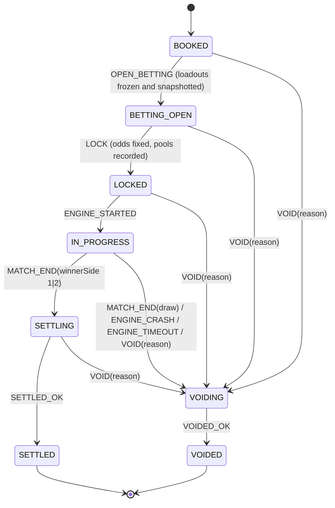

# Architecture (Phase 1: Stream MVP)

Scope: house characters, match cycle, Salt ledger, betting, fixed model odds, Glicko-2 ratings and tiers, fight stats, read API with live updates. Design source of truth: `docs/DESIGN.md`. Engine facts: `docs/ikemen-notes.md`.

## 1. Components

```
                         ┌───────────────────────────── orchestrator process (exactly one; pg advisory lock) ─────────────────────────────┐
                         │                                                                                                               │
  apps/web  ──HTTP/SSE──▶│  API (Fastify)  ──▶  Betting service ──┐                                                                      │
  (dev page)             │       ▲                               │                                                                      │
                         │       │ SSE bus                       ▼                                                                      │
                         │  Match cycle scheduler ──▶ Fight state machine: transition(state, event) ──▶ Settlement / Void ──▶ Ratings │
                         │       │  (matchmaking | tournament stub | exhibition stub)        │                                          │
                         │       ▼                                                            │ one DB txn per transition                │
                         │  Engine runner  ──spawn(argv)──▶ IKEMEN GO ──▶ runs/<fightId>/{events.ndjson, stdout, stderr, match.log}  │
                         │   (event source: live | sim | fake)                                                                           │
                         └───────────────────────────────────────────────────────────────┬───────────────────────────────────────────────┘
                                                                                         ▼
                                                                                   Postgres (Prisma)
```

| Package | Responsibility |
|---|---|
| `packages/shared` | Types, zod event schemas (engine NDJSON, SSE, API), odds math, Glicko-2, tier bands, config schema with defaults. Pure, no I/O. |
| `packages/db` | Prisma schema and migrations, ledger (`postTransaction`, balances, audit), repositories. |
| `packages/engine` | Roster (`roster.json`, scan, smoke), `EventSource` interface with `fake` / `sim` / `live`, runner (spawn, tail, watchdog, artifacts), Lua mod installer, per-run config generation. |
| `packages/orchestrator` | Pure `transition()`, cycle scheduler, matchmaking, betting, settlement/void, startup reconciliation, Fastify API and SSE. |
| `apps/web` | One plain HTML page: stream placeholder, fighter cards, bet panel, balance. |
| `ikemen/mods/salty_events.lua` | Emits NDJSON match events when `-salty.events <path>` is passed. |

Config: one typed config object (`packages/shared/config`) loaded from env and defaults. Open questions from DESIGN §15 become config values with defaults, flagged in the commit message.

## 2. Fight state machine



- `transition(state, event) → { state, effects[] } | IllegalTransition` is pure. Effects are data (`FreezeLoadouts`, `LockOdds`, `StartEngine`, `Settle`, `RefundAll`, …) run by the orchestrator.
- Each transition is one DB transaction: update `fight` with `WHERE id = ? AND version = ?` (optimistic concurrency, `version += 1`), insert a `fight_transition` audit row (from, to, event, payload, at), and apply the ledger effects in the same transaction. SSE is published after commit.
- Void reasons: `draw`, `engine_crash`, `engine_timeout`, `reconcile_orphaned`, `admin`.
- A test table covers every (state, event) pair: legal pairs produce the expected state, and everything else is rejected.

## 3. One fight end to end

1. **Book.** Scheduler asks the current mode (matchmaking) for a pairing: two enabled characters in the same tier, not a mirror match, not an immediate rematch, model chance in 40–60% (or a deliberate upset at the configured rate). Stage from `crypto.randomInt`. Insert `fight` in `BOOKED`.
2. **Open betting.** `OPEN_BETTING`: snapshot both loadouts (stats, rating, RD, volatility, tier) into `fight_loadout`. These are immutable from here. Betting window starts (default 60 s). SSE `state` and live estimated odds.
3. **Bets.** `POST /fights/:id/bet {side, amount, idempotencyKey}`. In one transaction: take the per-fight ledger lock (shared) and `SELECT … FOR SHARE` the fight row and require `BETTING_OPEN` (the `LOCK` transition takes `FOR UPDATE` on the same row, so no bet can commit after pools are snapshotted), `SELECT … FOR UPDATE` the user's available account, reverse their previous bet on this fight (escrow → user) if any, check funds, post the new stake (user → escrow[side]), and upsert `bet` (latest counts). Enforce the owner cap (0 owners now), min bet 1 and max stake. SSE odds update (model odds only; crowd split hidden).
4. **Lock.** `LOCK`: compute the model chance from Glicko-2 expected score, clamp to [5%, 95%], multiplier `(1/p)(1 − margin)` per side, then convert it once to an integer in basis points, **rounded down** (`multiplierBp`, e.g. 1.9× → 19000). From here on, money math is bigint only. Record `model_chance`, `crowd_chance` (per-account capped share), pools per side, and locked multipliers. Blend weight `w = pool/(pool+K)` is computed and stored but **config weight 0**, so locked = model.
5. **Fight.** Runner builds argv from the loadouts and stage and spawns the engine. `ENGINE_STARTED` → `IN_PROGRESS`. Events are tailed from `runs/<fightId>/events.ndjson` and broadcast as SSE. The watchdog kills at `engine_timeout` → `ENGINE_TIMEOUT` → void. Exit without `match_end` → `ENGINE_CRASH` → void.
6. **Result.** `match_end {winnerSide: 1|2}` → `SETTLING`. `winnerSide: 0` (draw) → `VOIDING`. Winner is a **side**, mapped to the character id the runner launched on that side.
7. **Settle (one transaction).** Pay winners, sweep losers to house (§4), update both characters' records, run a Glicko-2 update (one-game rating period per fight, each side rated against the other's pre-fight rating), re-evaluate tiers (promotion at the band threshold; demotion only below threshold − hysteresis, default 25; append `tier_history` on change; X is manual only), write `fight_result`, → `SETTLED`.
8. **Void (one transaction).** Refund every bet in full (escrow → user, no margin), no rating change, → `VOIDED`.
9. Scheduler books the next fight only after the current one is terminal (`SETTLED` or `VOIDED`), so matchmaking and loadout snapshots always use settled ratings. As on Salty Bet, the betting window is the gap between fights.

**Startup reconciliation:** acquire the advisory lock, then for each non-terminal fight: `BOOKED` or `BETTING_OPEN` → void (`reconcile_orphaned`), since the betting window was lost; `LOCKED` / `IN_PROGRESS` with no live process → void; `SETTLING` → retry settlement (idempotent keys); `VOIDING` → retry void.

## 4. Ledger (fixed odds)

Double-entry, integer Salt (`numeric(20,0)` ⇄ `bigint`). Every `ledger_txn` has entries summing to zero per asset, a unique `idempotency_key`, a `kind`, and references (fight, bet, user).

**Accounts** (`account(id, kind, owner_ref, asset='SALT', balance_cached, version)`):

| Account | Kind | May go negative? |
|---|---|---|
| `user:<userId>` | user available | **No** (checked under row lock) |
| `escrow:<fightId>:1`, `escrow:<fightId>:2` | fight escrow per side | No; ends at 0 when the fight is terminal |
| `house` | backs payouts; collects losing stakes and margin | Yes (P&L account) |
| `issuance` | source of grants and bailouts | Yes (goes negative by total Salt issued) |

**Postings** (debit = −, credit = +; each row sums to 0):

| Event | Entries |
|---|---|
| Starting balance / daily grant / bailout | `issuance −a`, `user +a` |
| Place bet `s` on side k | `user −s`, `escrow:k +s` |
| Change bet | reverse the old stake (`escrow:k −s₀`, `user +s₀`), then place the new one; one txn |
| Settle, side k wins, bet `s` at locked `multiplierBp_k` | payout `P = min(s × multiplierBp_k / 10000, maxPayout)` in bigint (integer division rounds down); `escrow:k −s`, `house −(P − s)`, `user +P` |
| Settle, losing side j | `escrow:j −Σs_j`, `house +Σs_j` |
| Void | per bet: `escrow:k −s`, `user +s` |

- Payouts round **down**, and the remainder stays with the house automatically (the house pays `P − s`).
- **Minimum multiplier 1.00× (`minMultiplierBp = 10000`, config).** At the 95% clamp with 5% margin the formula gives exactly 1.0 on paper, but float error can give 0.9999…, and any margin above 5% gives less than 1.0. Without a floor, a *winning* bet would lose Salt. Flagged for review.
- To keep `P ≥ s` under the payout cap, bets with `s > maxPayout` are rejected at placement.
- **Idempotency keys** (unique on `ledger_txn`, stored with a hash of the request so a reused key with a different body is rejected): bets use the client's key scoped to the user (`bet:<userId>:<clientKey>`); system writes use deterministic keys: `grant:start:<userId>`, `grant:daily:<userId>:<UTC date>`, `bailout:<userId>:<n>`, `settle:<fightId>`, `void:<fightId>`. Settlement and void are each one ledger txn for the whole fight, so retrying after a crash is a no-op, and a fight can't be both settled and voided.
- **Locks:** each operation takes its locks *before* checking its idempotency key, so concurrent duplicates queue and then replay. Bets take a per-fight advisory lock in shared mode plus the user's account row (`FOR UPDATE`); settle/void take the per-fight lock exclusively. No bet can commit during or after a fight's settlement.
- **Database guards** (migration `ledger_guards`): balances are maintained by a trigger on `ledger_entry` and can't be edited directly; a `CHECK` rejects any negative user or escrow balance; a deferred constraint trigger rejects any txn that doesn't sum to zero at commit; `ledger_txn` and `ledger_entry` are append-only.
- `ledger:audit`: every txn sums to zero; each `balance_cached` equals Σ entries; no user or escrow account is negative; escrow for terminal fights is 0; Σ all balances per asset is 0.
- The `asset` column exists everywhere with only `SALT` allowed, so a second asset later is data, not a migration.
- Tournament balances (phase 2) become separate account kinds (`user_tournament:<userId>`) on the same ledger.

## 5. Engine event sources

```ts
interface EventSource {
  run(spec: FightSpec, signal: AbortSignal): AsyncIterable<EngineEvent>; // ends with match_end | engine_crash | engine_timeout
}
```

- `fake`: scripted, no engine. Deterministic from a seed; can script draws, crashes and hangs. Used by tests and `pnpm demo`.
- `sim`: real engine with `-speedtest`, `-nosound`; smoke tests only, **never settles bets** (enforced in the orchestrator).
- `live`: real time, rendered; the only mode that settles.

Engine events (NDJSON, zod-validated): `match_start`, `round_start {round}`, `round_end {round, winnerSide|0, reason: ko|time}`, `match_end {winnerSide|0}`. Parsing `-log` after exit is the fallback if the Lua path fails (see ikemen-notes §2).

## 6. Data model sketch (Prisma)

- `User` (id, kind `anonymous|email`, email?, `walletAddress?` reserved, createdAt, lastDailyGrantAt)
- `Fighter` (id, archetype, defPath, displayName, licenseNote, enabled)
- `Character` (id, fighterId, `ownerKind='house'`, ownerUserId?, stats JSON with defaults, wins, losses, voids, rating, rd, volatility, tier, tierLocked (X))
- `TierHistory`, `Stage` (id, defPath, licenseNote, enabled)
- `Fight` (id, state, version, mode, stageId, bookedAt, windows, voidReason?, winnerSide?, winnerCharacterId?)
- `FightLoadout` (fightId, side, characterId, stats, rating, rd, volatility, tier), immutable
- `FightOdds` (fightId, modelChance[2], crowdChance[2], pool[2], blendWeight, lockedMultiplierBp[2] as integers; chances as floats for analysis only)
- `FightTransition` (audit), `Bet` (fightId, userId, side, stake, status, payout?), `Account`, `LedgerTxn`, `LedgerEntry`, `IdempotencyKey`
- Phase-2 placeholders only as fields: `Character.ownerUserId`, `stats`, `titles` (empty JSON). No shop, upgrade or title tables yet.

## 7. How stat upgrades will reach the engine (phase 2)

```
Character.stats ──(freeze at OPEN_BETTING)──▶ FightLoadout.stats ──▶ StatMapper ──▶ FightSpec.engineArgs ──▶ argv
```

- `StatMapper` has one entry per stat, each tagged `verified | unverified`. Only `verified` mappings emit anything. Unverified stats are stored and shown but have no engine effect, and the UI must say so.
- Verified now (source): `life`, `lifeMax`, `power` (and dizzy/guard points) via `-p<n>.<field>`.
- Attack/defense (UNVERIFIED): candidate A is a per-loadout generated character copy with `[Data] attack/defence` patched, cached by content hash under `runs/cache/chars/`; candidate B is `map.*` overrides plus common states. The winner gets chosen in phase 2 after a real-run test. It's recorded in `ikemen-notes.md` before use.
- Every stat change widens rating deviation (DESIGN §7), done where upgrades are applied, not in the engine layer.
